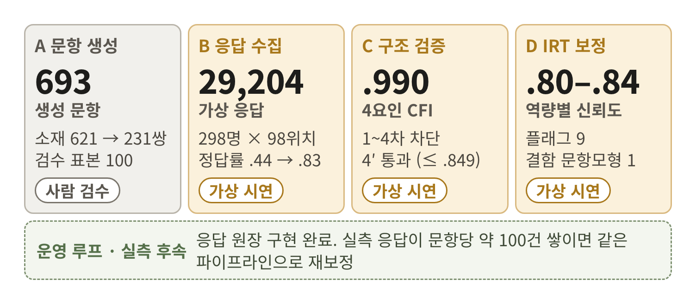
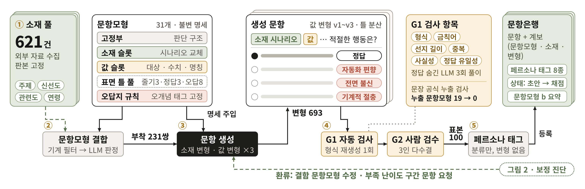
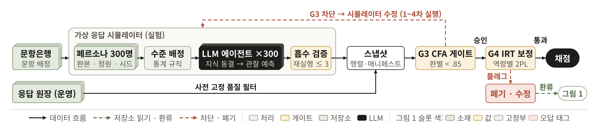
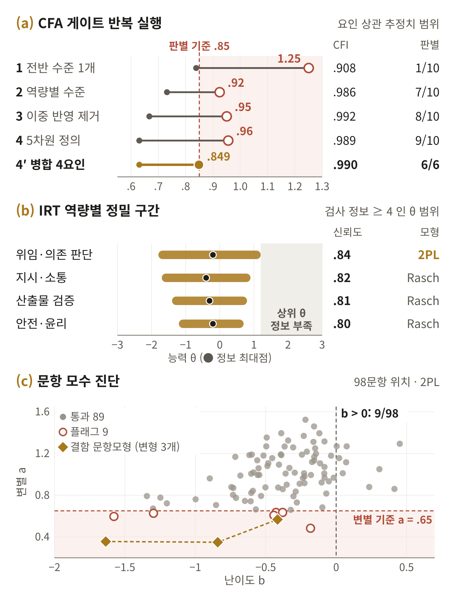

# AIG Assessment Pipeline

자동문항생성(AIG) 기반 동적 평가 문항의 **응답 수집 → 자동 검증(CFA 게이트) → IRT 보정** 파이프라인과 실험 데이터·결과를 공개한다. 열람과 논문 수치 확인용이며 오픈소스가 아니다([이용 조건](#이용-조건)).

> 김예성, 김동민, 조현준, 박주혜, "행동 기반 AI 활용 역량 척도 설계 및 자동문항생성을 활용한 동적 평가 문항 개발 프레임워크," 한국통신학회 2026 추계종합학술발표회 (투고).

**Abstract.** We make available for inspection the validation half of an automatic item generation (AIG) framework for a behavior-based AI-use competency scale. Virtual respondents sampled from NVIDIA Nemotron-Personas-Korea (n = 300, age quotas, rule-based AI-experience levels from official statistics) answer 100 reviewed items (98 item positions, 31 item models) through an observer-prediction protocol with hidden keys and shuffled options. Responses are packed into the same snapshot format as real app responses, screened by pre-registered quality filters, and passed through an automated CFA gate (WLSMV; CFI/TLI ≥ .90, RMSEA ≤ .08, factor-correlation estimate < .85) and per-competency 2PL IRT calibration (mirt; Rasch-vs-2PL LRT, S-X2, Q3, test information). Every number reported in the paper is regenerated by `bash scripts/reproduce.sh` in about 90 seconds and checked against `results/expected.json`.

<p align="center"></p>

## 프레임워크

논문의 프레임워크는 두 계층이다. 문항 생성 계층(논문 그림 1)은 소재 수집, 문항모형 결합, 소재·값 변형 생성, 검사·검수, 페르소나 태그 순서로 문항을 만든다. 이 계층의 코드와 문항 본문은 이 저장소에 없다.



문항 검증·보정 계층(논문 그림 2)은 응답 수집, 스냅샷, CFA 게이트(G3), IRT 보정(G4)으로 이어지고 보정 진단을 생성 계층으로 돌려준다. 이 저장소가 공개하는 범위가 이 계층이다.



## 이 저장소에 있는 것과 없는 것

| 구성 | 공개 | 비고 |
|---|---|---|
| 가상 응답 생성 (`simulation/`) | 코드 전체 | 페르소나 추출 · 수준 배정 · 요청/답 파일 · 흡수 검증 · 결정적 표집 · 스냅샷 내보내기 |
| 자동 검증 게이트 (`validation/cfa/`) | 코드 전체 | CFA 게이트 + 정답을 아는 합성 데이터로 게이트 자체를 시험하는 하네스 |
| IRT 보정 (`calibration/irt/`) | 코드 전체 | 역량별 2PL, 문항 플래그, 문항모형 단위 난이도 요약 |
| 실험 데이터 (`data/`) | 4개 실행의 응답 스냅샷 | 300명 × 98문항, 문항 ID·문항모형·차원·정답 글자만 |
| 실험 결과 (`results/`) | CFA 5개 · IRT 2개 | 스크립트가 다시 만든 산출물 + 논문 수치 기준값 |
| 문항 생성 파이프라인 | 공개하지 않음 | 논문 본문에서 설명한다 |
| 문항 본문(줄기·보기 문장) | 공개하지 않음 | 실제 측정 문항이라 노출되면 암기로 측정이 오염된다. `simulation/examples/demo-items.md` 의 데모 3문항으로 형식을 보인다 |

## 파이프라인

| 단계 | 하는 일 | 입력 | 출력 | 명령 |
|---|---|---|---|---|
| 1. 페르소나 추출 | 판본을 고정한 원본에서 시드·나이 정원(19~45세 70% · 46~63세 27% · 64~72세 3%)으로 300명 | Nemotron-Personas-Korea rev `ada0f5b` | `personas.jsonl` | `persona-sim.mjs fetch-parquet` → `personas --n 300 --seed 600` |
| 2. 수준 배정 | 연령대별 생성형 AI 경험률(과기정통부 2025)로 5단계 수준을 규칙 배정. 5역량 판은 영역 관련성 평정(인용 검증) + 개인 편차(-2/0/+2) | personas | `plan.json` · 요청 파일 | `prep [--dims --no-general --areas official]` |
| 3. 지식 상태 고정 | 인물 1명 = 에이전트 1개가 수준에 맞는 지식 상태를 서술, 형식 검증 뒤 동결 | 요청 파일 | `profiles.json` | 워크플로 `stage: profile` → `absorb-profiles` |
| 4. 문항 배정 | 문항모형마다 앵커 1개(전원) + 나머지 회전, 인물마다 순서 셔플 | 검수 끝난 문항 md | `assignment.json` · 문항 요청 | `items --md …` → `plan --rotate 3` |
| 5. 선택 예측 | 관찰자 시점으로 보기별 선택 확률 예측(정답 숨김 · 보기 셔플) | 문항 요청 | 답 파일 | 워크플로 `stage: solve` |
| 6. 흡수 · 표집 | 형식 검증(불량은 최대 3회 재시도) 후 확률분포에서 결정적 해시로 1개 표집 | 답 파일 | `results.json` | `absorb` |
| 7. 스냅샷 | 품질 필터 F1~F11 적용, 실응답과 같은 파일 형식 | results | `data/<run>/` | `emit --as-of … --out … --write` |
| 8. CFA 게이트 | WLSMV · 형제 문항 잔차 상관 · 판정(pass / fail / hold) · 1요인·병합 모형 내포 비교 | 스냅샷 | `cfa_*.json` | `Rscript validation/cfa/run-cfa.R` |
| 9. IRT 보정 | 역량별 1차원 2PL(MML-EM), Rasch 비교, S-X2, Q3, 검사 정보, 문항 플래그 | 스냅샷 + CFA 부하 | `irt/` | `Rscript calibration/irt/run-irt.R` |

`persona-sim.mjs` 는 LLM 을 직접 부르지 않는다. 요청 파일(`req/`)을 쓰면 에이전트가 답 파일(`ans/`)을 쓰고, 스크립트가 형식을 검증해 흡수한다. 논문 실험은 Claude Code 워크플로(`simulation/workflow/persona-sim.js`)로 300명을 3묶음 동시에 돌렸다. 스크립트와 실행기 사이의 접점은 요청·답 파일 형식뿐이다.

## 빠른 재현

필요: R 4.6.1, Node 22 이상(의존성 없음). 페르소나 단계까지 다시 하려면 Python 3 + pyarrow.

```bash
git clone https://github.com/ASM17-Watermelon/aig-assessment-pipeline.git
cd aig-assessment-pipeline
bash scripts/reproduce.sh            # R 패키지 설치(CRAN 2026-09-01 스냅샷) → 테스트 → CFA 5회 → IRT 2회 → 논문 수치 대조
```

마지막에 `논문 수치와 일치` 가 나오면 `results/expected.json` 의 모든 값(CFI · 요인 상관 · 판별 통과 쌍 · 판정 · 내포 비교 · 신뢰도 · 플래그 수 등)이 허용 오차 0.001 안에서 같다는 뜻이다. Apple M4 Pro(R 4.6.1 · lavaan 0.7.2 · mirt 1.47)에서 약 90초, IRT 산출 CSV 는 원 산출물과 바이트 단위로 같다. 중첩 비교 적합에서 lavaan 이 vcov 양정치 경고(최소 고윳값 약 -1e-17, 수치상 0)를 내지만 모든 모형이 수렴한다.

단계별로 직접 돌리려면(논문 표 1 의 4요인 CFA 와 IRT):

```bash
Rscript validation/cfa/run-cfa.R  --snapshot data/r300d --groups 1+5,2,3,4 --compare true --out runs/cfa4.json
Rscript calibration/irt/run-irt.R --snapshot data/r300d --groups 1+5,2,3,4 --cfa runs/cfa4.json --out runs/irt
```

`--groups 1+5,2,3,4` 는 차원 1(위임 판단)과 5(적정 의존·주체성)를 한 요인(위임·의존 판단)으로 묶는다.

LLM 없이 가상 응답 생성의 배선 전체(추출 → 수준 배정 → 지식 상태 → 배정 → 예측 → 흡수 → 스냅샷)를 확인하려면:

```bash
bash scripts/demo-pipeline.sh        # 데모 문항 3개 · 인물 6명 · 모의 응답기(결정적 의사 난수, 연구 데이터 아님)
```

페르소나 추출과 수준 배정이 논문 실험과 같은지 확인하려면(원본 parquet 약 2GB):

```bash
node simulation/persona-sim.mjs fetch-parquet
node simulation/persona-sim.mjs personas --run r300 --work runs/check --n 300 --seed 600 --parquet-dir runs/_hf/ada0f5b53a38bb5a30cce09358adde883c1ab63a
# runs/check/config.json 의 personas.file_sha256 = data/r300/manifest.json 의 값(6d40453a…)
node simulation/persona-sim.mjs prep --run r300 --work runs/check     # 수준 분포 never 128 · tried 47 · sometimes 34 · often 47 · daily 44
```

## 실험 결과

<p align="center"></p>

네 실행은 같은 300명(판본·시드 고정)에게 같은 98위치(검수 끝난 표본 100문항, 31개 문항모형)를 풀린 것이고, 응답 생성 조건만 다르다.

| 실행 | 응답 생성 조건 | N | 응답 | 수준별 정답률 (never → daily) |
|---|---|---|---|---|
| r300 | 전반 AI 사용 수준 1개 | 300 | 29,400 | .52 / .51 / .57 / .66 / .73 |
| r300b | 5역량 판: 영역 관련성 평정 + 개인 편차 | 297 | 29,106 | .49 / .52 / .62 / .71 / .83 |
| r300c | 5역량 판, 전반 수준 이중 반영 제거 | 299 | 29,302 | .42 / .52 / .61 / .70 / .81 |
| r300d | 5역량 판, 공식 5차원 정의 | 298 | 29,204 | .44 / .52 / .62 / .71 / .83 |

N 이 300 보다 작은 실행은 품질 필터 F5(한 세션 연속 8문항 같은 보기)에 걸린 인물이 빠진 것이다.

### CFA 게이트 (98위치, WLSMV, listwise)

| 실행 · 모형 | CFI | TLI | RMSEA | SRMR | 부하 중앙값 | 요인 상관 | 판별(추정치 < .85) | 1요인 대비 Δχ²(df) | 판정 |
|---|---|---|---|---|---|---|---|---|---|
| r300 · 5요인 | .908 | .904 | .007 | .088 | .24 | .84 ~ 1.25 | 1/10 | 8.0 (10), 기각 못 함 | fail |
| r300b · 5요인 | .986 | .985 | .006 | .083 | .44 | .73 ~ .92 | 7/10 | 170.8 (10) | fail |
| r300c · 5요인 | .992 | .992 | .006 | .078 | .50 | .67 ~ .95 | 8/10 | 479.1 (10) | fail |
| r300d · 5요인 | .989 | .989 | .007 | .079 | .52 | .63 ~ .96 | 9/10 | 599.9 (10) | fail |
| **r300d · 4요인 (위임·의존 판단 = D1+D5)** | **.990** | **.989** | **.007** | **.079** | **.51** | **.63 ~ .849** | **6/6** | **491.6 (6)** | **pass** |

전반 수준 하나로 응답을 만들면(r300) 다섯 차원이 한 요인으로 뭉쳐 1요인 모형과 구별되지 않고 게이트가 이를 떨어뜨린다. 남은 판별 실패는 위임 판단(D1)과 적정 의존·주체성(D5)의 상관 .956 이었고, 두 차원을 합친 4요인(위임·의존 판단 · 지시·소통 · 산출물 비판적 검증 · 안전·윤리)은 5요인과 적합 차이가 없으며(Δχ² = -0.44, df 4, p = 1.00) 게이트를 통과했다. 95% 상한 기준으로는 4요인도 4/6 쌍만 .85 아래다(`results/r300d/cfa_g15-2-3-4.json` 의 `ci_upper`).

### IRT 보정 (r300d, 역량별 1차원 2PL)

| 역량 | 문항 | Rasch 대 2PL Δχ²(df), p | AIC 선택 | 주변 신뢰도 | a 중앙값 (범위) | b 범위 | 정보 ≥ 4 구간 (θ) | 플래그 | S-X2 미흡 |
|---|---|---|---|---|---|---|---|---|---|
| 위임·의존 판단 (D1+D5) | 33 | 82.7 (32), < .001 | 2PL | .84 | .86 (.35 ~ 1.52) | -1.64 ~ .07 | -1.8 ~ 1.2 | 5 | 0 |
| D2 지시·소통 | 23 | 28.4 (22), .16 | Rasch | .82 | 1.09 (.71 ~ 1.46) | -.85 ~ -.15 | -1.7 ~ 0.9 | 0 | 0 |
| D3 산출물 비판적 검증 | 19 | 16.9 (18), .53 | Rasch | .81 | 1.13 (.79 ~ 1.40) | -.68 ~ .45 | -1.4 ~ 0.8 | 0 | 0 |
| D4 안전·윤리 | 23 | 35.5 (22), .034 | Rasch | .80 | .92 (.48 ~ 1.37) | -.65 ~ .24 | -1.2 ~ 0.7 | 4 | 0 |

플래그 9개는 모두 변별도 낮음(a < .65)이고, 그중 3개가 한 문항모형(F-D5-07)에 몰려 있다. 문항모형 안 난이도 SD 는 중앙값 .14 로 같은 모형의 변형들이 비슷한 난이도를 낸다. b > 0 인 문항은 98개 중 9개뿐이고 θ = 2 에서 조건부 SE 가 .65 ~ .80 이라, 상위 능력대를 재려면 어려운 문항을 보강해야 한다. 상세: `results/r300d/irt/irt_report.md`, 5역량 대조: `results/r300d/irt5/`.

**해석 범위.** 위 결과는 가상 응답이다. 게이트와 보정 절차가 끝까지 돌고 기대한 방향으로 판정한다는 것을 보이는 시연이며, 변별도 값 자체를 척도의 성질로 주장하지 않는다(인물에게 넣은 구조의 세기를 반영한다). 가상 모수는 실사용자 채점에 쓰지 않고, 실응답이 문항당 약 100건을 넘으면 같은 스크립트로 다시 보정한다.

## 자동 검증 게이트와 임계값

| 단계 | 규칙 | 기준 | 위치 |
|---|---|---|---|
| 흡수 검증 | 인물 id 일치 · 문항별 확률 줄 존재 · 확률 합 95~105(100 으로 정규화) · 요청보다 많은 문항 없음 · 평정 ±1 은 인물 정보 원문 인용 | 위반 시 `rejected/` 로 옮기고 최대 3회 재시도 | `simulation/persona-sim-lib.mjs` |
| 응답 점검 | 평균 정답률 .30 ~ .85 · 인물 점수 SD ≥ .08 · 문항-나머지 상관 ≥ .10 · 정답 키 의심(상위 25% 가 한 오답을 .5 이상) · 화면 위치 편향 | 위반 시 리포트 경고 | `data/<run>/report.md` |
| 스냅샷 필터 | F1 첫 시도 · F2 채점 응답 · F3 완주 · F4 3초 미만 · F5 연속 8문항 같은 보기 · F6 코호트 · F7 회수 문항 · F8 극단 정답률 · F9 반응왜곡 · F11 선택형 | 데이터를 보기 전에 고정 | `simulation/snapshot-lib.mjs` |
| CFA 게이트 | CFI · TLI ≥ .90, RMSEA ≤ .08, 요인 상관 추정치 < .85, 요인당 지표 ≥ 4, n ≥ 200 | 모두 만족하면 pass, n 부족이면 hold | `validation/cfa/run-cfa.R` |
| CFA 보고 | SRMR(n < 500 이면 .10), WRMR < 1.0, 부하 < .40 약함 · < .30 회수 후보, 내포 비교 Δχ² p < .05 이고 ΔCFI ≥ .01 이면 기각 | 게이트가 아닌 보고 지표 | 같은 파일 |
| IRT 플래그 | 변별 a < .65 낮음 · < .35 매우 낮음, \|b\| > 3 극단, S-X2 BH 보정 p < .05 미흡, Q3 가 평균보다 .20 이상 큼 | 플래그 문항은 수정 또는 폐기 후보 | `calibration/irt/run-irt.R` |

CFA 게이트 자체는 정답을 아는 합성 데이터로 시험한다: `node validation/cfa/simulate-snapshot.mjs --out runs/sim --n 300` 후 `run-cfa.R --model five`(합격), `--model four`·`one`(내포 비교로 기각). 시나리오 매트릭스는 `node validation/cfa/run-matrix.mjs --out runs/matrix`.

## 가상 응답 생성 방식

- **인물**: NVIDIA Nemotron-Personas-Korea(합성 한국인 페르소나 100만 명, CC BY 4.0) 판본 `ada0f5b53a38bb5a30cce09358adde883c1ab63a` 에서 시드 600 으로 오프셋을 뽑고 나이 정원을 채운다. 같은 판본·시드면 같은 사람이 뽑힌다.
- **수준은 LLM 이 정하지 않는다**: 연령대별 생성형 AI 경험률(과학기술정보통신부 2025 인터넷이용실태조사; 50대는 40대·60대 선형 보간 추정)로 사용 여부를 정하고, 사용자 안에서는 tried · sometimes · often · daily 를 균등 배정한다. LLM 이 인구통계로 수준을 추정하면 그 모델의 고정관념이 자료에 섞이기 때문이다.
- **5역량 판**(r300b ~ r300d): 차원 수준 = 전반 수준(0~4) + 영역 관련성 평정(-1/0/+1, 인물 정보 원문 인용이 있어야 인정) + 개인 편차(-2/0/+2, 시드 해시로 각 1/3)를 0~4 로 자른 값. 배정한 차원 수준끼리의 상관은 .35 ~ .42 다.
- **두 단계 분리**: 지식 상태를 먼저 서술해 동결하고, 다른 에이전트가 그 상태를 받아 문항을 푼다. 문항 내용이 수준 서술에 끌려가지 않게 하기 위해서다.
- **관찰자 예측**: 에이전트가 직접 푸는 대신 "이 인물이 각 보기를 고를 확률"을 a~d 백분율로 낸다. 정답은 보여 주지 않고, 보기 순서는 인물×문항 시드로 섞으며, 모르는 인물은 끌리는 오답을 1순위로 두도록 지시한다. 역할극 방식은 정렬된 모델이 자기 지식으로 정답을 맞혀 정답률이 천장에 붙는다.
- **결정적 표집**: 분포에서 `sha256(choice|seed|인물|문항)` 으로 선택 1개를 뽑는다. 다시 흡수해도 같은 선택이 나오고, 확률은 `synthetic_detail.csv` 의 `p_a` ~ `p_d` 에 남는다.
- **모델**: `claude-sonnet-5-5`(평정 · 지식 상태 · 풀이 모두, Claude Code 서브에이전트). 파일럿에서 Haiku 4.5 는 형식 불량 7/12 로 제외했다. 요청 판본은 각 `data/<run>/manifest.json` 의 `prep.profile_prompt` · `solve.prompt` 에 있다.

## 디렉터리

```
simulation/            가상 응답 생성 CLI(persona-sim.mjs) · 순수 함수(persona-sim-lib.mjs, snapshot-lib.mjs) · 테스트
  workflow/            Claude Code 워크플로(인물 1명 = 에이전트 1개, 재실행 시 남은 인물만)
  examples/            데모 문항 3개 · 모의 응답기
validation/cfa/        CFA 게이트(run-cfa.R) · 게이트 시험용 합성 생성기와 매트릭스
calibration/irt/       2PL 보정(run-irt.R)
data/<run>/            응답 스냅샷(아래 파일 설명) · manifest.json(판본·시드·정원·수준 규칙·요청 판본·파일 해시)
results/               reproduce.sh 산출물 · expected.json(논문 수치 기준값)
scripts/               reproduce.sh · check-results.mjs · demo-pipeline.sh
```

스냅샷 파일: `responses_wide_family.csv`(행 = 응답자, 열 = 위치, 0/1/NA; CFA·IRT 입력) · `responses_wide.csv`(변형 열) · `responses_long.csv` · `positions.csv` · `items.csv`(문항 ID · 문항모형 · 차원 · 정답률, 본문 없음) · `respondents.csv`(나이 · 성별 · 학력 · 직업 · 지역 · 배정 수준 · 원본 uuid) · `synthetic_detail.csv`(응답별 보기 확률 · 선택 · 정답 글자) · `report.md`(점검 리포트). 앱 응답 원장과 같은 형식이라 앱 전용 열(`mission_*` 등)은 비어 있다.

## 데이터 가용성

문항 본문은 공개하지 않는다. 이 문항들은 앱에서 실제로 쓰는 측정 문항이고, 공개되면 응답자가 정답을 외워 측정이 오염된다. 그래서 외부에서 재현할 수 있는 범위는 (1) 공개 응답 행렬에서 CFA · IRT 결과까지 전부, (2) 페르소나 추출과 수준 배정(원본 판본·시드로 바이트 단위 재현), (3) 데모 문항으로 가상 응답 생성의 배선 전체다. 비공개 문항 md 의 sha256 은 각 `manifest.json` 의 `items.md_sha256` 에 남겨 실험 뒤 문항이 바뀌지 않았음을 확인할 수 있게 했다. 공개판에서는 내부 경로와 작업 식별자만 지웠고(`manifest.json` 의 `publication` 항목), CSV 는 원 산출물과 바이트가 같다.

## 이용 조건

이 저장소는 오픈소스가 아니다. 논문 심사와 결과 확인을 위해 공개했고, 저자가 만든 부분의 모든 권리는 저작권자에게 있다(`LICENSE`).

- 허용: 열람, 그리고 논문의 수치와 절차를 확인할 목적으로 내려받아(clone 포함) 수정 없이 실행하는 것.
- 사전 서면 허락 없이는 불가: 위 확인 목적의 내려받기를 뺀 코드·데이터·결과·그림·문서의 복제, 수정, 재배포, 다른 소프트웨어·데이터셋·연구 산출물에 가져다 쓰기, 상업적 이용.
- 응답자 속성(나이·성별·학력·직업·지역·uuid)의 출처는 NVIDIA Nemotron-Personas-Korea(CC BY 4.0, https://huggingface.co/datasets/nvidia/Nemotron-Personas-Korea)다. 이 값에는 원본의 CC BY 4.0 이 그대로 적용되고 위 제한은 적용하지 않는다. 출처 표기와 변경 사항은 `data/LICENSE-DATA.md` 에 있다.
- R 패키지 lavaan · mirt 는 GPL 이며 이 저장소는 그것을 호출만 한다.

## 인용

```bibtex
@inproceedings{kim2026aig,
  title     = {행동 기반 AI 활용 역량 척도 설계 및 자동문항생성을 활용한 동적 평가 문항 개발 프레임워크},
  author    = {김예성 and 김동민 and 조현준 and 박주혜},
  booktitle = {한국통신학회 추계종합학술발표회 논문집},
  year      = {2026},
  note      = {투고}
}
```
